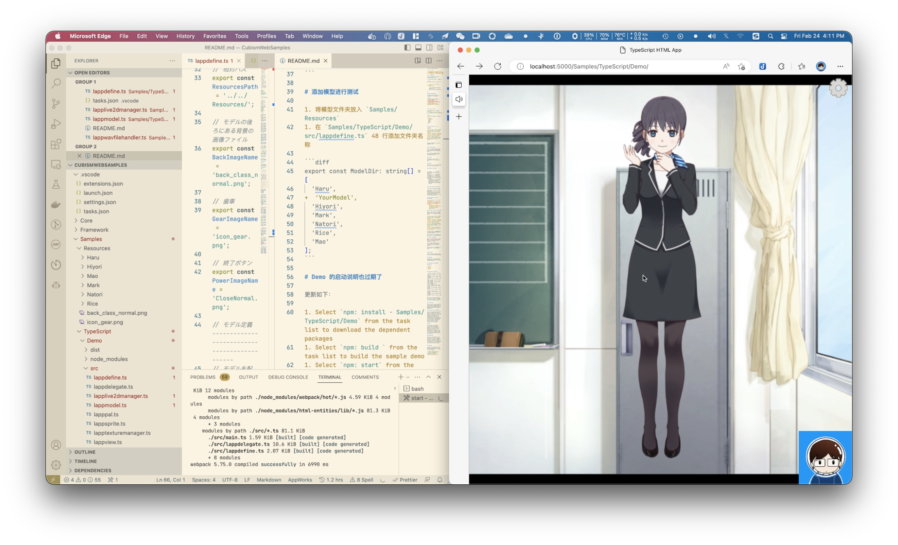

带口型同步的 Live2D Web Demo


# 关于 lip sync

1. 最新版的Web SDK 已经支持口型同步
1. 但是默认没有播放音频，而且口型参数很小，几乎看不见以至于测试时一直以为有问题

因此把这个调整过的demo放出来，供有同样需求的同学参考。

点下图查看实际测试例子：

[](./demo.mp4)

## 播放音频的方法

`Samples/TypeScript/Demo/src/lappwavfilehandler.ts`

在 asyncFileLoad 函数中加入音频播放

```diff
const asyncFileLoad = async () => {
    
+    const sound = new Audio(filePath);
+    sound.play();
    
    return fetch(filePath).then(responce => {
    return responce.arrayBuffer();
    });
};
```

## 调整口型大小的方法

`Samples/TypeScript/Demo/src/lappmodel.ts` 524 行左右

```diff
for (let i = 0; i < this._lipSyncIds.getSize(); ++i) {
-    this._model.addParameterValueById(this._lipSyncIds.at(i), value, 0.8);
+    this._model.addParameterValueById(this._lipSyncIds.at(i), value, 5);
}

```

# 添加模型进行测试

1. 将模型文件夹放入 `Samples/Resources`
1. 在 `Samples/TypeScript/Demo/src/lappdefine.ts` 48 行添加文件夹名称

```diff
export const ModelDir: string[] = [
  'Haru',
+  'YourModel',
  'Hiyori',
  'Mark',
  'Natori',
  'Rice',
  'Mao'
];
```

# Demo 的启动说明也过期了

更新如下：

1. Select `npm: install - Samples/TypeScript/Demo` from the task list to download the dependent packages
1. Select `npm: build ` from the task list to build the sample demo
1. Select `npm: start` from the task list to start the simple server for operation check
1. Enter `http://localhost:5000/Samples/TypeScript/Demo/` in the URL field of your browser to access it

---

[English](README.md) / [日本語](README.ja.md)

---

# Cubism Web Samples

This is a sample implementation of an application that displays models output by Live2D Cubism 4 Editor.

It is used in conjunction with the Cubism Web Framework and Live2D Cubism Core.


## License

Please check the [license](LICENSE.md) before using this SDK.


## Notices

Please check the [notices](NOTICE.md) before using this SDK.


## Directory structure

```
.
├─ .vscode          # Project settings directory for Visual Studio Code
├─ Core             # Directory containing Live2D Cubism Core
├─ Framework        # Directory containing source code such as rendering and animation functions
└─ Samples
   ├─ Resources     # Directory containing resources such as model files and images
   └─ TypeScript    # Directory containing TypeScript sample projects
```


## Live2D Cubism Core for Web

A library for loading the model.

This repository does not manage Cubism Core.
Download the Cubism SDK for Web from [here](https://www.live2d.com/download/cubism-sdk/download-web/) and copy the files in the Core directory.


## Development environment construction

1. Install [Node.js] and [Visual Studio Code]
1. Open **the top directory of this SDK** in Visual Studio Code and install the recommended extensions
    * In addition to pop-up notifications, you can check the others by typing `@recommended` from the Extensions tab

### Operation check of sample demo

Enter `>Tasks: Run Task` in the command palette (*View > Command Palette...*) to display the task list.

1. Select `npm: install - Samples/TypeScript/Demo` from the task list to download the dependent packages
1. Select `npm: build ` from the task list to build the sample demo
1. Select `npm: start` from the task list to start the simple server for operation check
1. Enter `http://localhost:5000/Samples/TypeScript/Demo/` in the URL field of your browser to access it
1. Enter `>Tasks: Terminate Task` from the command palette and select `npm: serve` to terminate the simple server

For other tasks, see [README.md](Samples/TypeScript/README.md) of the sample project.

NOTE: Settings for debugging are described in `.vscode/tasks.json`.

### Project debugging

Open **the top directory of this SDK** in Visual Studio Code and enter the *F5* key to start Debugger for Chrome.

You can place breakpoints in Visual Studio Code to debug in conjunction with the Chrome browser.

NOTE: Settings for debugging are described in `.vscode/launch.json`.


## SDK manual

[Cubism SDK Manual](https://docs.live2d.com/cubism-sdk-manual/top/)


## Changelog

Please refer to [CHANGELOG.md](CHANGELOG.md) for the changelog of this repository.


## Development environment

### Node.js

* 19.6.0
* 18.14.0
* 16.19.0
* 14.21.2


## Operation environment

| Platform | Browser | Version |
| --- | --- | --- |
| Android | Google Chrome | 109.0.5414.117 |
| Android | Microsoft Edge | 109.0.1518.80 |
| Android | Mozilla Firefox | 109.2.0 |
| iOS / iPadOS | Google Chrome | 110.0.5481.83 |
| iOS / iPadOS | Microsoft Edge | 109.0.1518.80 |
| iOS / iPadOS | Mozilla Firefox | 109.0 |
| iOS / iPadOS | Safari | 16.3 |
| macOS | Google Chrome | 110.0.5481.77 |
| macOS | Microsoft Edge | 110.0.1587.41 |
| macOS | Mozilla Firefox | 109.0.1 |
| macOS | Safari | 16.3 |
| Windows | Google Chrome | 110.0.5481.78 |
| Windows | Microsoft Edge | 110.0.1587.41 |
| Windows | Mozilla Firefox | 109.0.1 |

Note: You can start the server for operation check by running the `serve` script of `./Samples/TypeScript/Demo/package.json`.


## Contributing

There are many ways to contribute to the project: logging bugs, submitting pull requests on this GitHub, and reporting issues and making suggestions in Live2D Community.

### Forking And Pull Requests

We very much appreciate your pull requests, whether they bring fixes, improvements, or even new features. Note, however, that the wrapper is designed to be as lightweight and shallow as possible and should therefore only be subject to bug fixes and memory/performance improvements. To keep the main repository as clean as possible, create a personal fork and feature branches there as needed.

### Bugs

We are regularly checking issue-reports and feature requests at Live2D Community. Before filing a bug report, please do a search in Live2D Community to see if the issue-report or feature request has already been posted. If you find your issue already exists, make relevant comments and add your reaction.

### Suggestions

We're also interested in your feedback for the future of the SDK. You can submit a suggestion or feature request at Live2D Community. To make this process more effective, we're asking that you include more information to help define them more clearly.


## Community

If you want to suggest or ask questions about how to use the Cubism SDK between users, please use the community.

- [Live2D community](https://community.live2d.com/)
- [Live2D 公式コミュニティ (Japanese)](https://creatorsforum.live2d.com/)
